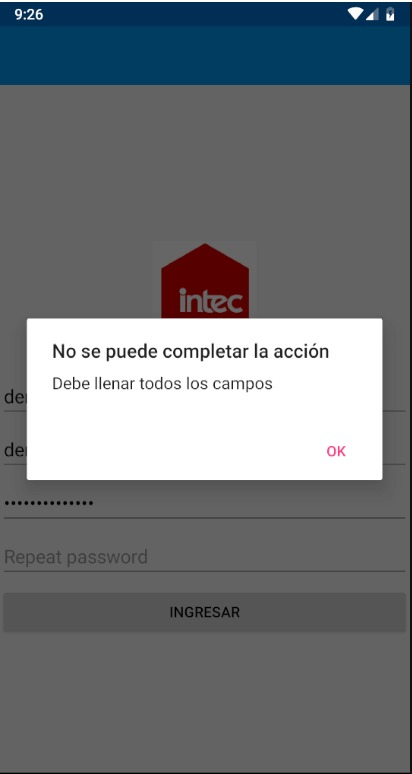
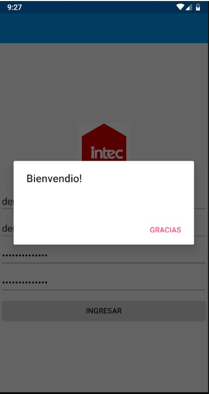
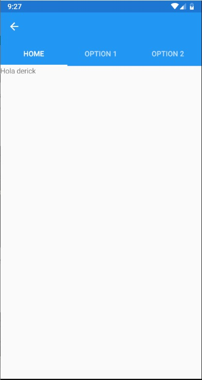

# XamarinLoginExample

To log in, you must complete all the entries, and be aware that both passord's and repeat passord's entries are the same. Otherwise, it will display some alerts:

Finally, you will get into de home page, which have a label with the name that you wrote in the initial page.

        

